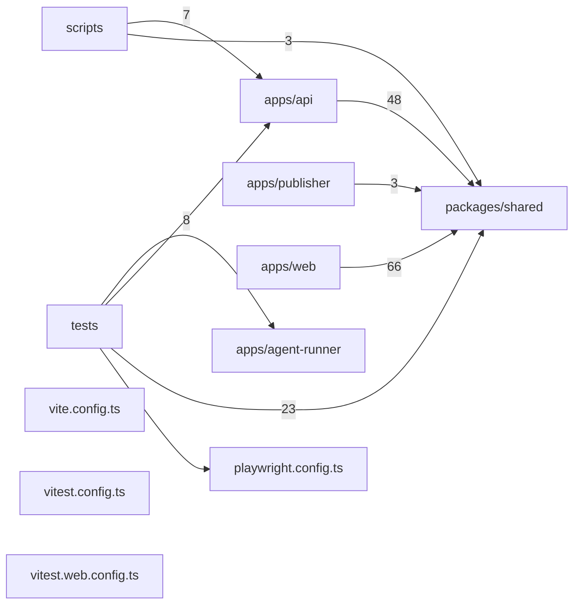

# Module dependencies

Generated by `pnpm arch:graph` (ArchUnitTS). Edge labels count file-level imports.

```mermaid
flowchart LR
  n0["apps/agent-runner"]
  n1["apps/api"]
  n2["apps/publisher"]
  n3["apps/web"]
  n4["packages/shared"]
  n5["playwright.config.ts"]
  n6["scripts"]
  n7["tests"]
  n8["vite.config.ts"]
  n9["vitest.config.ts"]
  n10["vitest.web.config.ts"]
  n1 -->|48| n4
  n2 -->|3| n4
  n3 -->|66| n4
  n6 -->|7| n1
  n6 -->|3| n4
  n7 --> n0
  n7 -->|8| n1
  n7 -->|23| n4
  n7 --> n5
```
